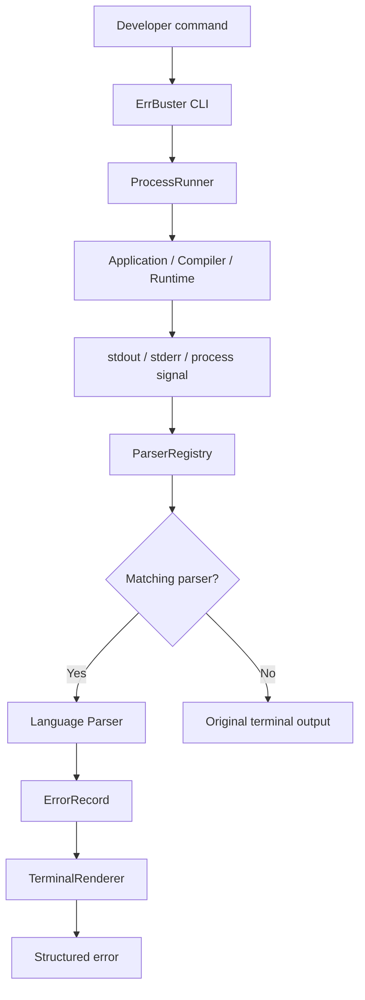
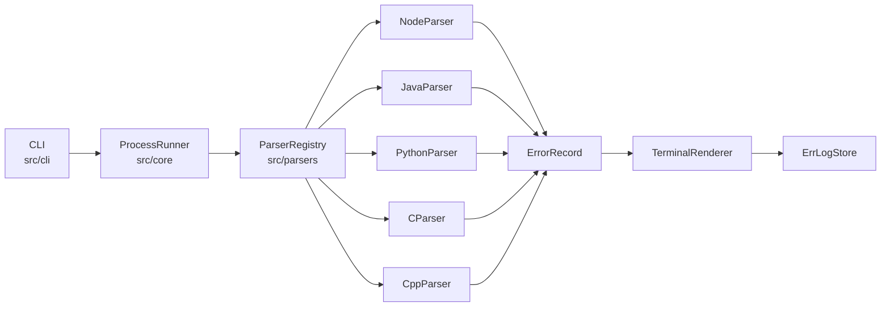
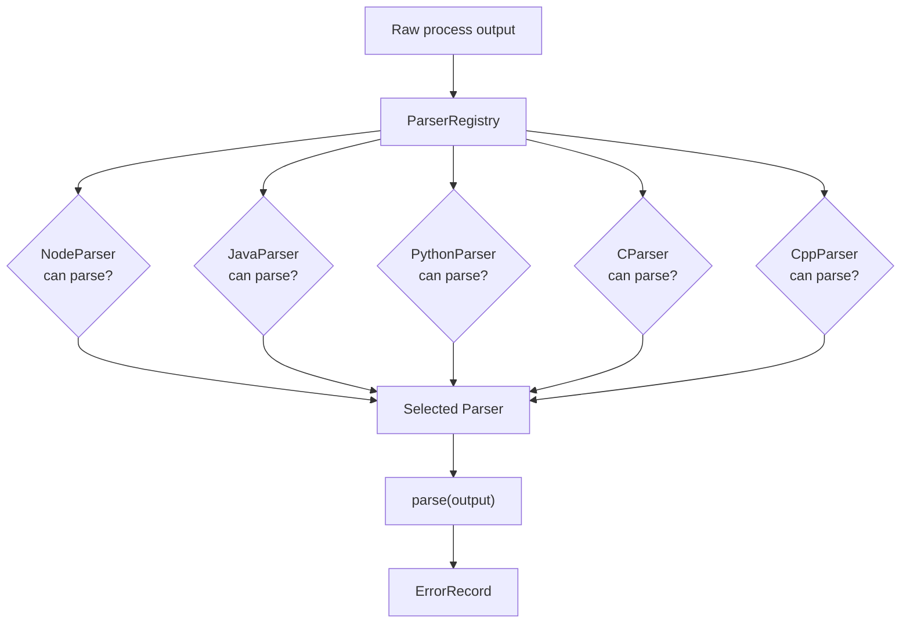
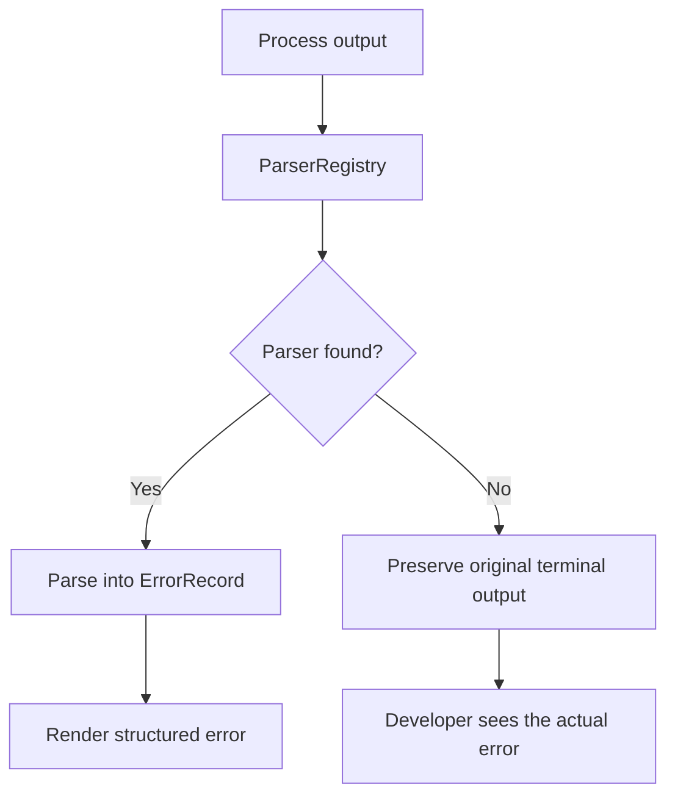
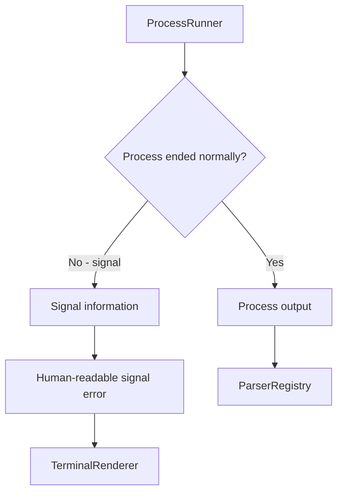
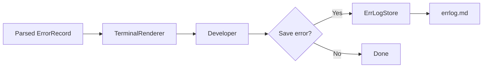
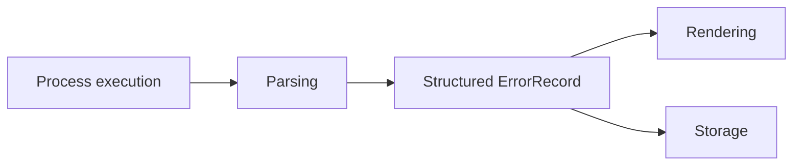

# ErrBuster

> A multi-language CLI for parsing and presenting application, runtime, compiler, and process errors in a developer-friendly format.

ErrBuster runs a command, captures its output, recognizes supported error formats, extracts useful information, and presents the result in a structured terminal interface.

When ErrBuster does not recognize an error, it preserves the original terminal output instead of hiding or rewriting it.

---

## ✨ What is ErrBuster?

Different programming languages and tools produce errors in very different formats.

For example, Node.js may produce:

```text
TypeError: Cannot read properties of undefined (reading 'name')
    at file:///app/crash.js:5:18
```

A Java application may produce:

```text
Exception in thread "main" java.lang.NullPointerException
    at Main.main(Main.java:7)
```

A C++ compiler may produce:

```text
main.cpp:6:20: error: expected ';' at end of declaration
```

And a native process may terminate with:

```text
SIGSEGV
```

ErrBuster provides a common CLI experience for these different error formats.

---

## Supported Languages

ErrBuster currently supports:

- **Node.js**
- **Java**
- **Python**
- **C**
- **C++**

The parser architecture is designed so that language-specific logic stays isolated from the core execution pipeline.

This means the project is **multi-language today** and **extensible by design**, rather than claiming to support every programming language.

---

## 🚀 How It Works

At a high level:



The important design principle is:

> **ErrBuster improves errors it understands and preserves errors it does not.**

---
# 🛡️ Fail-Open Design

One of the core design goals of ErrBuster is **fail-open behavior**.

ErrBuster is a development aid. It should not become another failure point that prevents the developer's command from running or hides the application's real output.

### If ErrBuster does not understand an error

It does not replace it with:

```text
Unknown Error


flowchart TD
    A["Application / compiler output"] --> B["ParserRegistry"]
    B --> C{"Recognized?"}

    C -->|Yes| D["Parse and render"]
    C -->|No| E["Preserve original output"]

    D --> F["Developer"]
    E --> F

The intended fail-open principle
If ErrBuster can improve the error:
    improve it.

If ErrBuster cannot understand the error:
    leave it alone.

If ErrBuster itself encounters a problem:
    do not hide the original application output.

This principle is especially important for a CLI wrapper.

# 🏗️ Architecture

ErrBuster is organized around clear separation of responsibilities.



### Core components

#### ProcessRunner

Responsible for:

- Starting external processes
- Passing arguments to the process
- Capturing `stdout`
- Capturing `stderr`
- Detecting process termination signals
- Returning the process result to the CLI

#### ParserRegistry

Responsible for selecting the parser that understands the captured output.

#### Language Parsers

Each parser contains language/tool-specific parsing logic.

Currently:

```text
NodeParser
JavaParser
PythonParser
CParser
CppParser
```

#### ErrorRecord

Provides a common structure for parsed errors:

```typescript
export interface ErrorRecord {
  type: string;
  message: string;
  stack?: string;
  file?: string;
  line?: number;
  column?: number;
}
```

#### TerminalRenderer

Turns a structured `ErrorRecord` into the formatted terminal output shown to the developer.

#### ErrLogStore

Persists a recognized error when the developer chooses to save it.

---

# 🔌 Parser Architecture

Every language parser follows the same contract:

```typescript
export interface Parser {
  canParse(output: string): boolean;
  parse(output: string): ErrorRecord | null;
}
```

This keeps language-specific parsing separate from the rest of the application.



Adding support for another language should primarily involve adding a parser and its tests rather than rewriting the process execution and rendering layers.

---

# 🛡️ Unknown Error Fallback

ErrBuster deliberately does **not** display an artificial "Unknown Error" when a parser cannot recognize the output.

For example, suppose an application produces:

```text
Application started
CUSTOM_DIAGNOSTIC: Something unexpected happened
```

If no parser understands that diagnostic, ErrBuster leaves the original output alone.



This is an important safety principle for a developer tool:

> **ErrBuster should never hide information simply because it cannot understand it.**

---

# ⚡ Process Signal Handling

ErrBuster also handles process-level termination signals.

Currently handled signals include:

| Signal | Human-readable result |
|---|---|
| `SIGSEGV` | Segmentation Fault |
| `SIGABRT` | Aborted |
| `SIGTERM` | Process Terminated |
| `SIGKILL` | Process Killed |
| `SIGINT` | Interrupted |

For example:

```text
ERRBUSTER • ERROR

Type       Segmentation Fault

Message    The program tried to access invalid memory.
           This can be caused by a null pointer,
           invalid pointer, or out-of-bounds memory access.
```

The signal is handled separately from language-specific parsers because an operating-system process signal is not a language-level exception.



---

# 💻 Usage

ErrBuster is designed to run commands through a single interface:

```bash
errbuster <command> [arguments...]
```

### Node.js

```bash
errbuster node app.js
```

### Python

```bash
errbuster python3 app.py
```

### Java

```bash
errbuster java -jar app.jar
```

### Spring Boot

```bash
errbuster ./mvnw spring-boot:run
```

### C / C++

For a compiled program:

```bash
errbuster ./examples/main
```

For compiler diagnostics:

```bash
errbuster gcc examples/main.c -o examples/main
```

```bash
errbuster g++ examples/main.cpp -o examples/main
```

The command and its arguments are passed through to the underlying process.

---

# 🧪 Examples

## Node.js

```bash
errbuster node examples/crash.js
```

ErrBuster can extract:

```text
Type
Message
File
Line
Column
Stack Trace
```

Example:

```text
Type       │ TypeError
Message    │ Cannot read properties of undefined (reading 'name')
File       │ file:///app/crash.js
Location   │ 5:18
```

---

## Java

A Java runtime exception can be converted into a structured representation:

```text
Type       │ java.lang.NullPointerException
Message    │ Cannot invoke "String.length()" because "<local1>" is null
File       │ Main.java
Location   │ 7
```

---

## Python

Python traceback information can be parsed into:

```text
Type
Message
File
Line
Stack Trace
```

For example:

```text
Type       │ AttributeError
Message    │ 'NoneType' object has no attribute 'name'
```

---

## C

Compiler diagnostics such as:

```text
examples/main.c:5:5: error: expected ')'
```

can be rendered as:

```text
Type       │ CError
Message    │ expected ')'
File       │ examples/main.c
Location   │ 5:5
```

---

## C++

Compiler diagnostics such as:

```text
examples/main.cpp:6:20: error: expected ';' at end of declaration
```

can be rendered as:

```text
Type       │ CppError
Message    │ expected ';' at end of declaration
File       │ examples/main.cpp
Location   │ 6:20
```

C and C++ have separate parsers so that their diagnostic formats can evolve independently.

---

# 💾 Error Logging

After ErrBuster successfully parses an error, it can optionally store the structured error:

```text
Save this error to errlog.md? (y/n):
```

The developer decides whether the error should be stored.

The storage layer is intentionally separate from parsing and rendering.



---

# 📁 Project Structure

```text
errbuster/
│
├── src/
│   │
│   ├── cli/
│   │   ├── index.ts
│   │   ├── run.ts
│   │   └── prompt.ts
│   │
│   ├── core/
│   │   ├── ErrorRecord.ts
│   │   ├── Parser.ts
│   │   └── ProcessRunner.ts
│   │
│   ├── parsers/
│   │   ├── ParserRegistry.ts
│   │   │
│   │   ├── node/
│   │   │   └── NodeParser.ts
│   │   │
│   │   ├── java/
│   │   │   └── JavaParser.ts
│   │   │
│   │   ├── python/
│   │   │   └── PythonParser.ts
│   │   │
│   │   ├── c/
│   │   │   └── CParser.ts
│   │   │
│   │   └── cpp/
│   │       └── CppParser.ts
│   │
│   ├── renderer/
│   │   └── TerminalRenderer.ts
│   │
│   └── storage/
│       └── ErrLogStore.ts
│
├── tests/
│   ├── core/
│   ├── parsers/
│   │   ├── node/
│   │   ├── java/
│   │   ├── python/
│   │   ├── c/
│   │   └── cpp/
│   ├── renderer/
│   └── storage/
│
├── examples/
│
├── package.json
├── tsconfig.json
└── README.md
```

---

# 🧱 Design Principles

### Separation of concerns

Each part of the system has a focused responsibility:



This prevents language-specific parsing code from spreading throughout the application.

### Extensible parser design

The core pipeline does not need to know the details of every supported language.

```text
ProcessRunner
      ↓
ParserRegistry
      ↓
Language-specific Parser
      ↓
ErrorRecord
      ↓
Renderer / Storage
```

### Safe fallback

Unsupported output is preserved rather than transformed into potentially misleading information.

---

# 🧪 Testing

ErrBuster uses [Vitest](https://vitest.dev/) for automated testing.

Run the complete test suite:

```bash
npx vitest run
```

Tests currently cover:

- `ErrorRecord`
- `ProcessRunner`
- Node.js parsing
- Java parsing
- Python parsing
- C parsing
- C++ parsing
- Terminal rendering
- Error storage

The parser tests verify both successful parsing and rejection of output that does not belong to that parser.

---

# 🔧 Development

Clone the repository:

```bash
git clone <repository-url>
cd errbuster
```

Install dependencies:

```bash
npm install
```

Run ErrBuster in development mode:

```bash
npm run dev -- node examples/crash.js
```

Run the test suite:

```bash
npx vitest run
```

Type-check the project:

```bash
npx tsc --noEmit
```

---

# 📌 Current Status

ErrBuster currently provides:

```text
Node.js error parsing       ✅
Java error parsing          ✅
Python error parsing        ✅
C compiler error parsing   ✅
C++ compiler error parsing ✅

Process signal handling     ✅
Unknown-error fallback      ✅
Terminal rendering          ✅
Error persistence           ✅
Automated tests             ✅
```

The project is currently focused on building a reliable foundation for multi-language error diagnostics.

---

# ⚠️ Limitations

ErrBuster currently supports a defined set of languages and diagnostic formats.

Not every possible error from a supported language will necessarily match the current parser.

Compiler versions, runtime versions, operating systems, and command-line tools can produce different diagnostic formats.

When ErrBuster cannot recognize an error, it preserves the original terminal output.

ErrBuster also works by launching the command itself. Globally installing the CLI does not automatically monitor unrelated processes running elsewhere on the machine.

Use:

```bash
errbuster <command>
```

to execute a process through ErrBuster.

---

# 🤝 Contributing

Contributions are welcome.

If you want to add support for another language or diagnostic format, the preferred approach is to add:

```text
src/parsers/<language>/<Language>Parser.ts
tests/parsers/<language>/<Language>Parser.test.ts
```

The new parser should implement the existing `Parser` interface and avoid introducing language-specific logic into the core execution pipeline.

---

# 🗺️ Future Direction

The current focus is reliability and a clean developer experience.

Potential future improvements may include:

- More diagnostic formats
- More languages
- Improved compiler diagnostics
- Better source-location handling
- Improved terminal rendering
- More sophisticated error grouping
- Configuration support
- More useful debugging context

These are future possibilities rather than promises about the current release.

---

# 📄 License

This project is licensed under the MIT License.

See the `LICENSE` file for details.

---

# 🎯 Vision

ErrBuster is built around a simple idea:

> **Make terminal errors easier to understand without getting in the developer's way.**

The project aims to provide a consistent developer experience across different languages and tools while keeping language-specific complexity isolated inside individual parsers.

The core principle is:

```text
Understand what you can.
Preserve what you cannot.
Never hide the original error.
```
